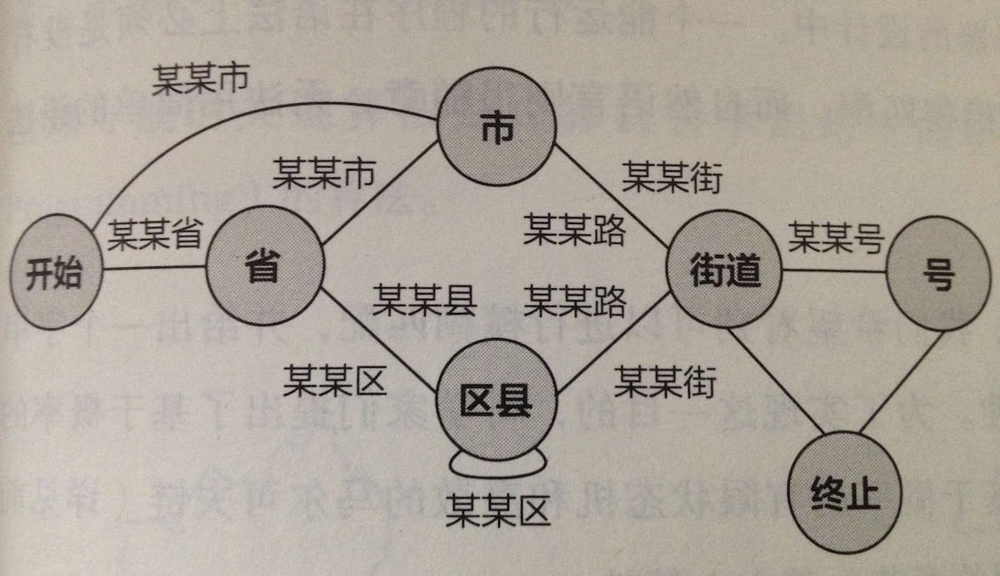

扩展阅读：关于有限状态机(FSM)

有限状态机(Finite-state machine)，是一种非常常用的概念模型，在计算机领域有着广泛应用。

从定义的角度来讲，FSM的模型包括包含一组状态集（states）、一个起始状态（start state）、一组输入符号集（alphabet）、一个映射输入符号和当前状态到下一状态的转换函数（transition function）

*状态：*

它就像整个机器在当前情况下的“快照”，包含了整个模型现在的所有情况，比如说如果是一个游戏角色，会包括它的所有属性和动作。

*起始状态：*

可以理解为状态机的入口

*输入符号集：*

你输入的参数。针对不同的参数FSM会有不同的执行结果

*转换函数：*

状态间的转换关系

从微观的角度来说，它的要素在于四点：当前状态，转换条件，动作，下一状态。

在满足转换条件的时候，当前状态执行动作，然后跳转到下一状态。

Talk is cheap,show me the example.

(图来自《数学之美》)

这是一个对地址正确性的判断，在上图中，如果接收的第一个词组和省有关，那么进入状态是“省”，然后如果遇到一个词组和（区）县名有关，就进入状态“区县”；如果遇到的下一个词组和城市有关，那么我们就进入“市”的状态。如果第一个词组跟市有关，那就直接进入“市”的状态。如果一条地址能从状态机的起始状态经过状态机的若干中间状态，走到终止状态，那么这条地址则有效，否则无效。比如说，“辽宁省大连市凌海路1号”对于上面的有限状态来讲有效，而“大连市辽宁省凌海路1号”则无效（因为无法从“市”走回到“省”）。

（FSM是有向图，他该画箭头的）

换句话说，每一步操作都是基于上一个状态。

如果我没搞错的话，if-else只是FSM的条件判断部分，但是用FSM代替if-else完全可行。

FSM的经典应用：

+ 游戏AI（感兴趣的可以实现一下）

在游戏里，NPC可以到处游走，可以跟你有剧情的对话，依赖的都是FSM。

+ 冯·诺依曼体系下的计算机

从理论上，冯·诺依曼体系的计算机包含五部分，存储器，运算器，控制器，输入和输出设备。

其中存储器保存了状态，输入设备是一种输入集，运算器实现了状态的变换，控制器驱动了状态的变化，和状态的转移。输出设备相当于状态机的终止状态。

从实践中，据说计算机底层的确就是组合逻辑实现状态的变化，时钟驱动了状态的变换。不过对电路我不太懂。

+ 图灵完备的编程语言（C,C++,Java,Python,Assemble Language...）

图灵完备的语言它的计算原理仍然是状态自动机，核心就是命令。但是图灵机应该属于无限状态机。

具体的区别...你自己必应去。我个人倾向于觉得图灵机是扩展升级版的FSM。

所以，编程语言是计算机里面的计算机。这句话虽然很玄，但的确没错。

至于基于Lambda演算和逻辑递归的，使用的应该跟FSM无关。